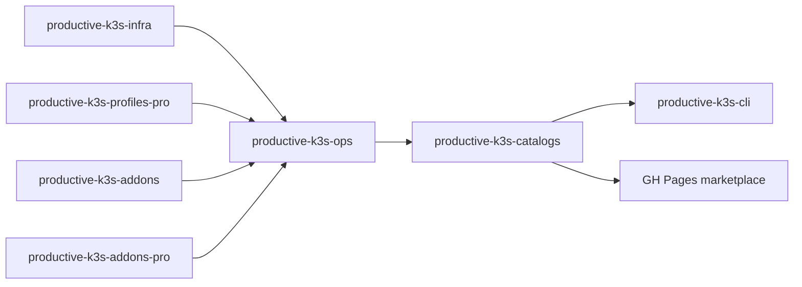

# Productive K3S Catalogs

Productive K3S Catalogs is the public discovery point for installable Productive K3S content.

It exposes a CLI-readable catalog and a marketplace-style web portal for:

- infrastructure scenarios;
- environment profiles;
- optional add-ons;
- public and protected/pro entries.

[Open marketplace](catalog.md){ .md-button .md-button--primary }

## How it fits

## Catalog responsibilities

This repository does not own the implementation of scenarios, profiles or add-ons. It publishes the index that points to them.

Public entries can point directly to downloadable artifacts. Protected entries can point to a purchase, contact, or authorization flow.
